# T2A2 - Marketplace Project

#### R7 Identification of the problem you are trying to solve by building this particular marketplace app.

Locals supporting locals.
Making contributions to your local communities is always encouraged to help stimulate your local economy and sustain jobs. These days, it is somewhat difficult to figure out if large gatherings in real Sunday markets are deemed safe. What are the thoughts of individuals when it comes to large social gatherings? The problem is that the stalls are lacking potential buyers.
Therefore, the sellers, who, a lot of them are artists, are lacking support. To support artists, also in consequence, supports the practice of creative thinking and innovation. 
So, this app supports the local art business’ going by assisting buyers and sellers to reach their audience in a fast and convenient way, without paying stall fees.  The app is also the solution to keeping the ‘Covid bugs away’.
What’s great is, you don’t have to wait till Sunday to browse, buy, or sell.

#### R8 Why is it a problem that needs solving?

Let’s not let art die. As mentioned above, art brings out a creative mind, which stimulates innovation. Hopefully, someone will build an app to help support music and drama as well, but today, I will focus on the little artist that wants to make pretty little things or paint great big things.

#### R9 A link (URL) to your deployed app (i.e. website)

https://sunday-market-nga.herokuapp.com/

#### R10 A link to your GitHub repository (repo). - Ensure the repo is accessible by your Educators

https://github.com/NgaNaNa/Sunday_Market_ROR

#### R11 Description of your marketplace app (website), including:

- Purpose

This two-sided marketplace web application allows signed in users to post up art pieces that they would like to sell, and also be able to purchase listings from other user.
A registered and signed in user should be able to quickly create a listing without great difficulty, that should include basic details of the art piece, and also upload an image. They are able to accept credit card payments from the buyer (who is also a registed user like them).

- Functionality / features

The App has the feature that allows users to sign up and have their own account. The App then gives authorised users to perform the functions to create listings, buy listings via credit card, serach for local sellers to help buy arts locally.

All account holders will have a profile page, whether they have it filled out or not, that is optional. However, as a seller, having a profile page completed gives buyer get a better feel of who they are buying their goods from.

Stripe will be the payment gateway, if using credit card. This give users confidence in the application’s security management system. This feature should be optionally, allowing users to choose from a variety of payment systems, such as bank transfer, Pay ID, or cash.

- Sitemap

Sunday Market Site Map

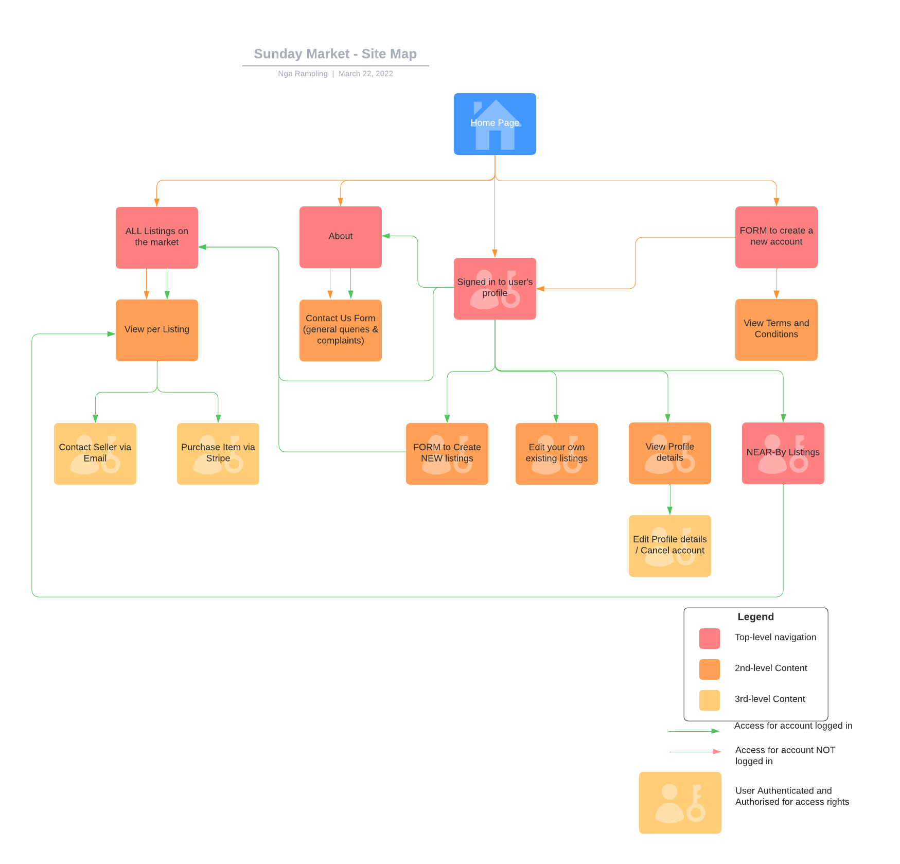

- Screenshots of the website

Create listing page

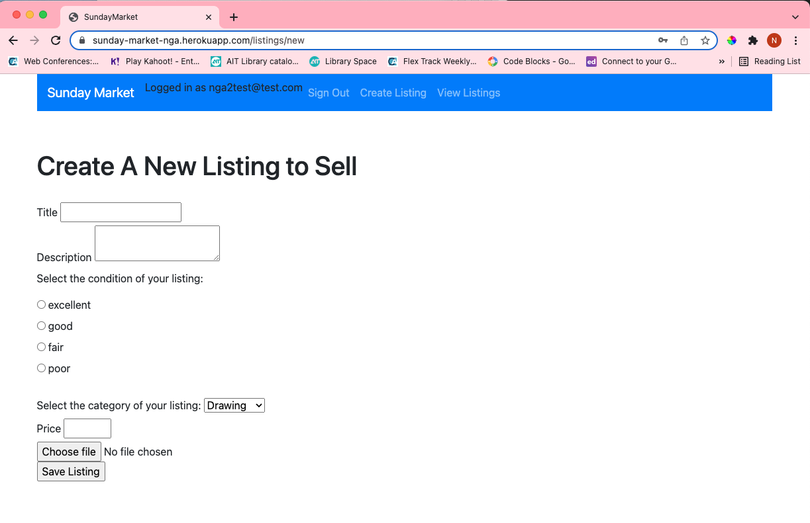

Edit listing page

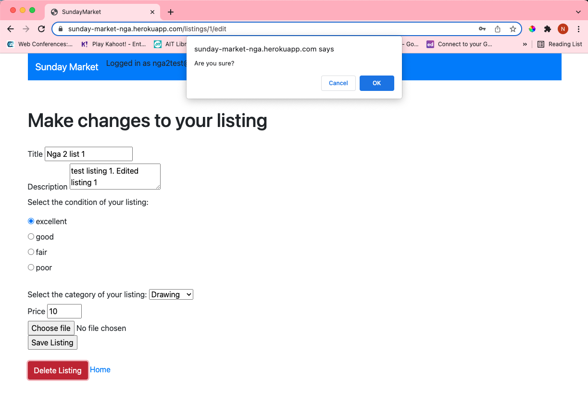

Home page

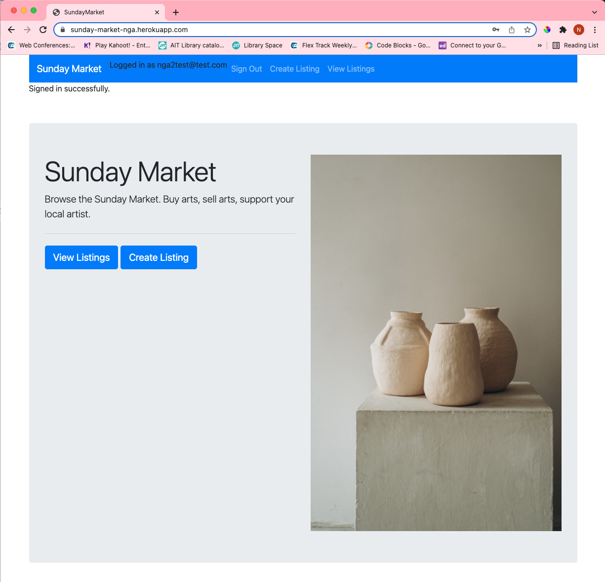

View all listings page

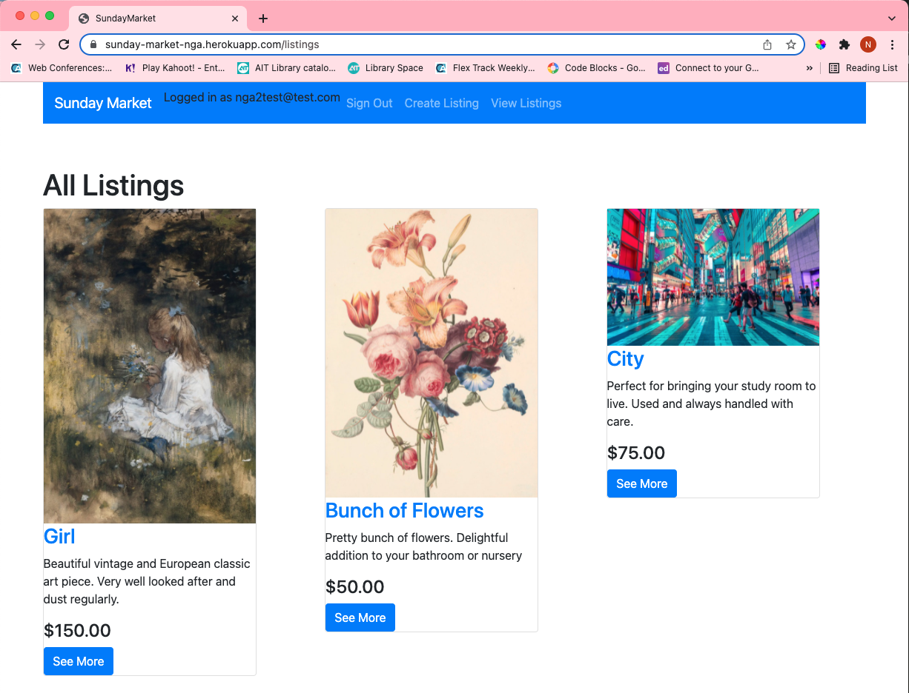

Sign in page

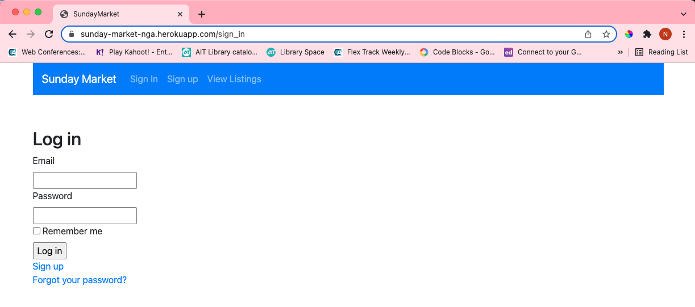

Sign up page

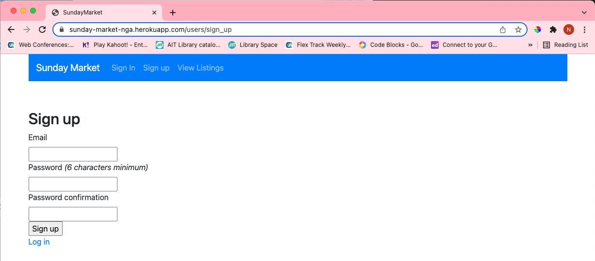

- Target audience

The target audience are for anyone with a working smartphone, tablet, desktop devices with connection to the internet. Users don't need to have a credit card for purchasing, as they may want to contact the seller via e-mail to arrange alternative payments and exchange of the goods. As this app is also targetted towards audience with intention to purchase locally, hopefully travelling shouldn't too much of a hassle. Alternatively, the seller and buyer may arrange for items to be delivered if they are unable to get out. For example, stuck in isolation.

- Tech stack (e.g. html, css, deployment platform, etc)

    - html
    - css
    - Heroku for deployment (Staging and Production)
    - AWS S3 for cloud service (Storing static website resources (files) uploaded by registered users of the app)
    - Stripe (Gateway payment system including all the good stuff I don't need to worry about, security and protection)
    - Ruby on Rails for the framework of building the application
    - Ruby Devise Gem to help with user authentication and validation of sessions
    - PostgreSQL for RDBMS
    - Bootstrap for front end styling framework
    - Github for source control and trigger for Heroku automatic deployment
    - geokit-rails

#### R12 User stories for your app

- As a user, I want to have a profile page where I can easily update myself.
- As a user, I want to view all listings, filter listings to find neary-by listings.
- As a user, I want to create my ownn listing and be able to manage this individually and also collectively, such as a edit function after a listing is created.
- As a user, I want to buy other users' listings using credit card in a safe enviroment.
- As a user, I want to be able to delete my own account.
- As a user, I want to have confidence that only myself can make modications to my own profile page and any listing I may have.
- As a user, I want to be able to view all listings without having to log in to do so.
- As a user, I want to be able to contact the app owner if I have any questions or have any complaints
- As a user, I want to be able to contact the seller of a listing and ask many questions.

#### R13 Wireframes for your app

Create Account wireframe

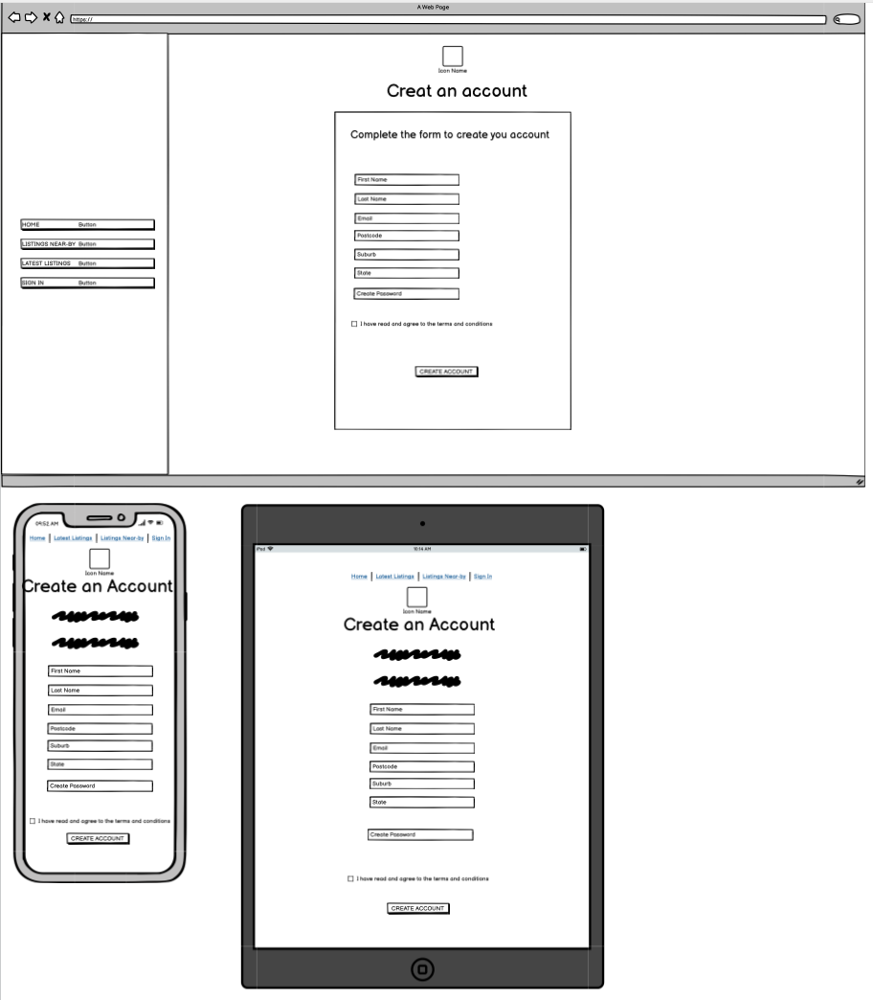

Home wireframe

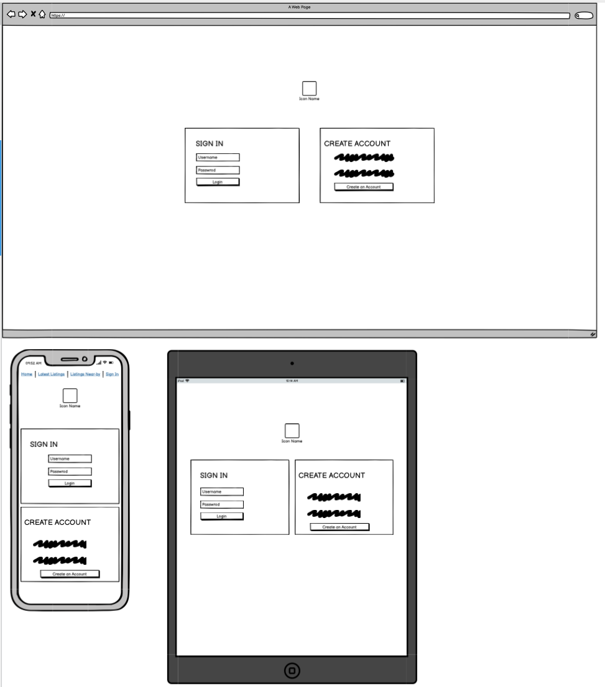

Listing wireframe

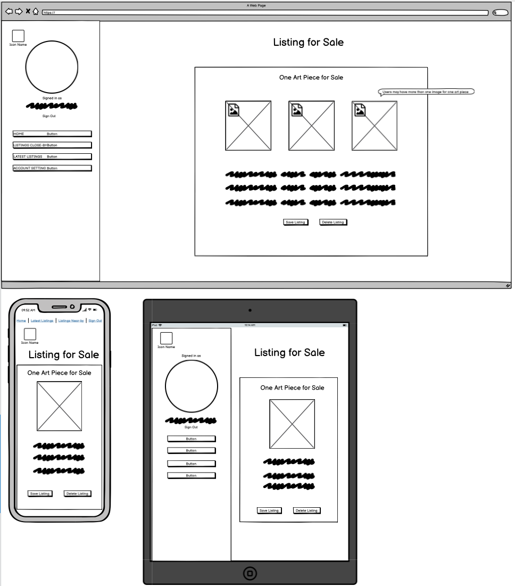

Profile wireframe

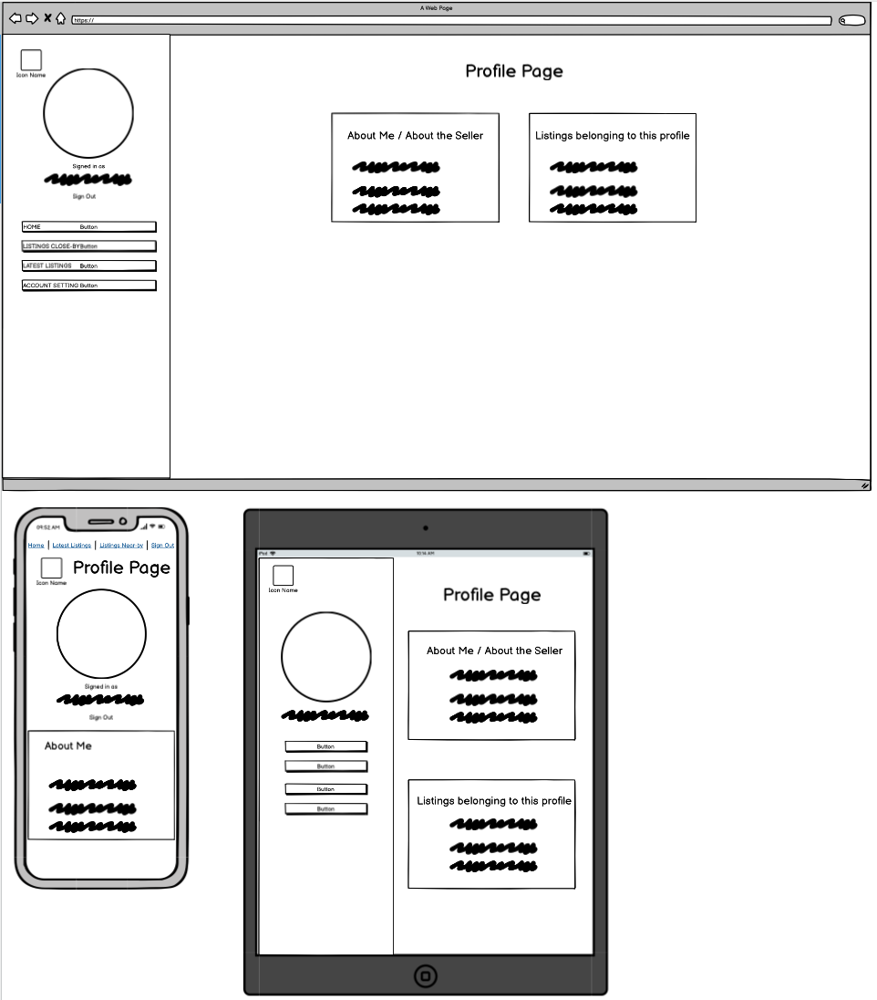

Create listing wireframe

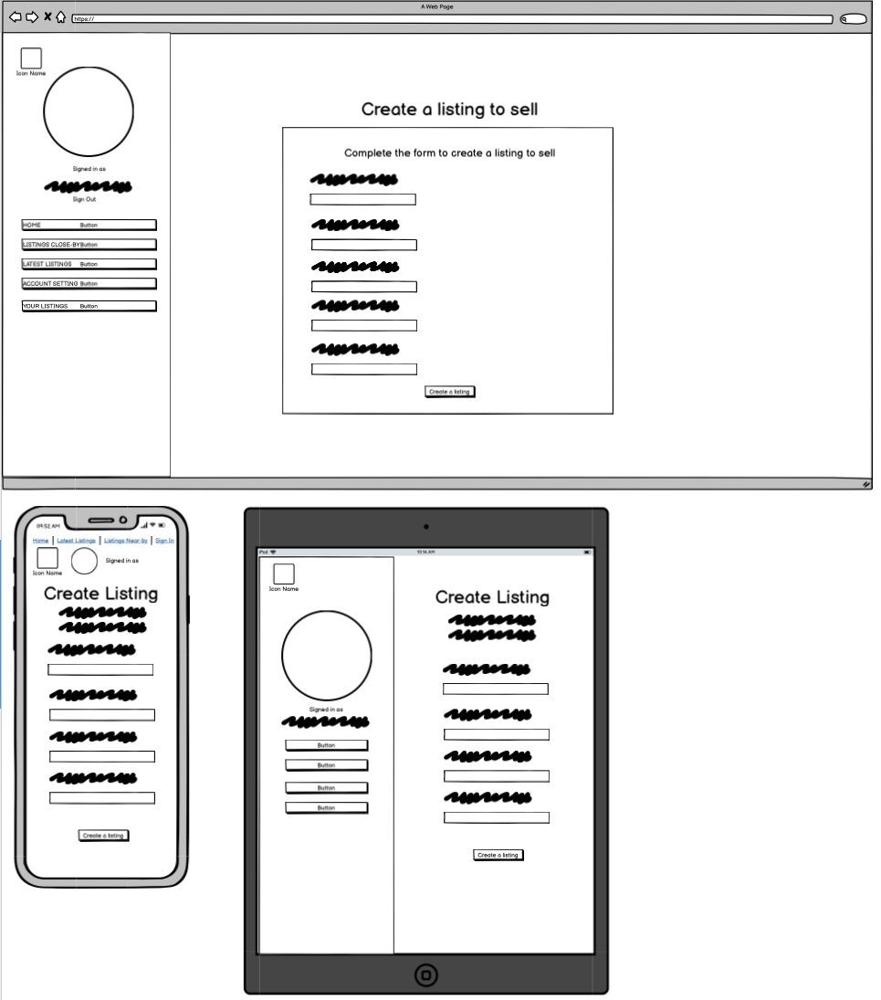

#### R14 An ERD for your app

Sunday Market ER Diagram

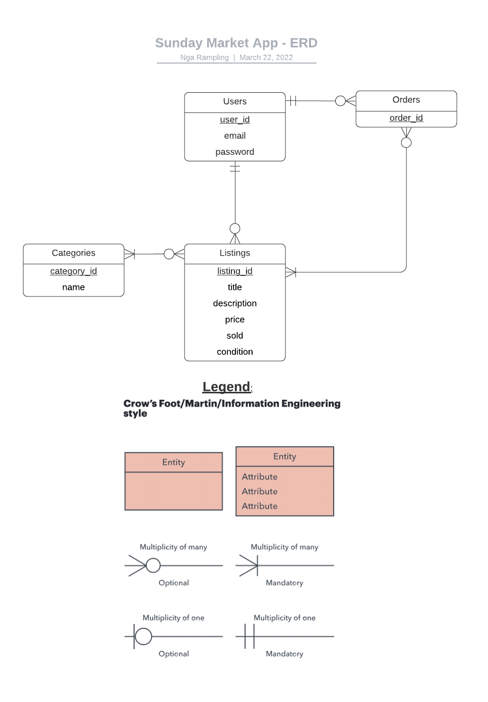

#### R15 Explain the different high-level components (abstractions) in your app

Ruby on Rails take something complex, such as building an application from scratch, and allow you to implement many features in a simpler and faster way. Making use of a framework of library that is ready made. The following are some high-level abstractions used in the application.

##### Active Record Associations

Active Record Associations allows model tables to have defined relationships. This allows models have clear instruction on how they should behave and react with one another.

An empty model would always, at least, would be a class with inheritance methods from the file ApplicationRecord. ApplicationRecord inherits from Active Record::Base. An example below is a typical empty model call Author without relationship.

`class Author < ApplicationRecord
end`

The following code snippet below is an example of a model with inheritance from ApplicationRecord and relationship rules placed upon it. If a model has a relationship placed upon it, it means that the other other model must also exist. In other words, it takes two models to make a relationship work.

`class Author < ApplicationRecord
    has_many :books, dependent: :destroy
end`

`class Book < ApplicationRecord
    belongs_to :author
end`

The Author model shown above means that it may have many books record added to the Author table, and the Book model table may only belong to one Author. For example, deleting an Author record would ultimately deletes its associated books.

##### Action Controller

Each model would typically require its own controller, with the same name but plural. For example, an Author model would have an Authors controller.
Each controller is basically a class with inheritance from a file called ApplicationController. ApplicationController inherits from ActionController::Base.
With the inheritance classes, controller can define the actions (methods) of each http request that is coming from the views, the interface where the user interacts. The actions or methods may acquire data by following the structure of the model, and instruct the view to render out the data.

##### Views and partials

The views would generally have simple codes to help render the pages. A lot of its functions and methods have been code up from the controller and its data looked after by the models, as mentioned above. 
Views have special helper files called 'partials' (sometimes called 'shared'), it's often used as a template to assist pages repeat information on allocated pages, such as a navbar, or a form.
Views also offer pages to be styled and programmed collaboratively between html and ruby, henece the file names with extension example.html.erb (erb for embedded ruby)

#### R16 Detail any third party services that your app will use

##### Heroku

Using Heroku for web application hosting and deployment platform. Heroku is linked to the project's github repository and so therefore, any new updates pushed to the project's remote repository, Heroku picks this up and runs with the new updates from the application via Github.
However, any new updates on the database, schema or seeds file that is ready for deployment, we must also run a migration to see the live changes.
Heroku also needs to acknowledge the unique access keys and secret keys from AWS S3 to pass the credentials test.

##### Github

Using Github to manage service for git source control repositories, and also to trigger automatic deployment through Heroku.

##### AWS S3

Using AWS S3 for the cloud service, where files will be stored by users' uploads of static images for thier listings.

#### R17 Describe your projects models in terms of the relationships (active record associations) they have with each other

The User model may have none to many 'listing' and 'order' records, and this is defined in the User model class as `has_many :listings` and `has_many :orders`. This is possible because the class User is inherits from ApplicationRecord. 
The Listing model must have one, and only one user for its record and so we define in the class Listing as `belongs_to :user`. This completes the relationship between User and Listing model.
The Listings model will have `belongs_to :category` as it must also have a category value, but `has_one :order` only as these art pieces are sold off one at a time. Hence the reason why Order model is defined as `belongs_to :user` and `belongs_to :listing`

#### R18 Discuss the database relations to be implemented in your application

In SQL, relations are represented by tables, with each row in a table representing a single tuple, and the values of each attribute forms a column.

Every table will have it's one and only, unique Primary key. If this table was to be recognised by another table, then it would be called a Foreign Key to that table.

The starting place for the Sunday Market App relations is Listings.

In the Listings table, we will have user_id being the Foreign key because the user has its own table, holding other data that is relative to its user id number. The other foreign key in the Listings table is category_id. This is because in Sunday Market a Listing can belong to one category.

The Orders table has 2 foreign keys, user_id and listing_id. The user_id is from the purchaser (user_id found in User table). The listing_id is from the Listing table

#### R19 Provide your database schema design

Sunday Market Schema

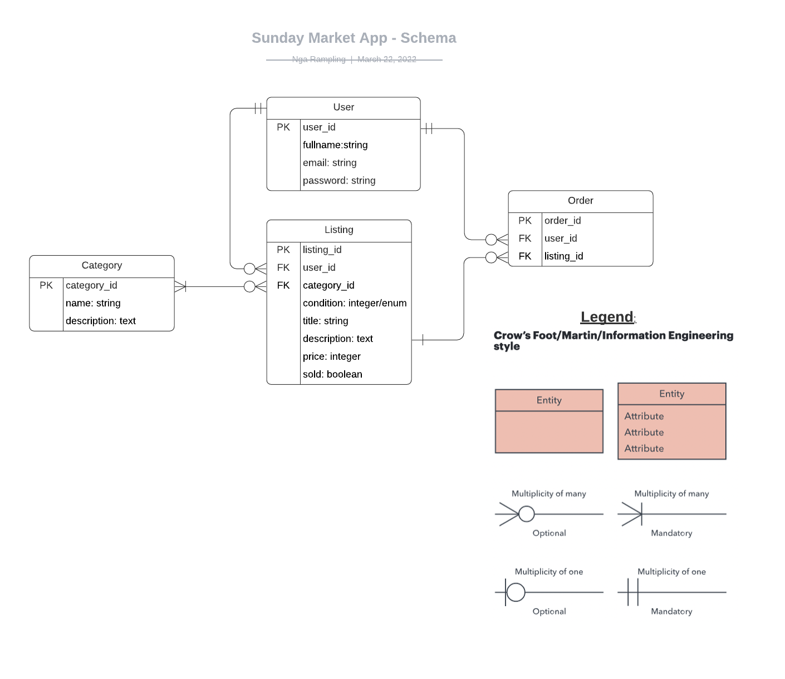

#### R20 Describe the way tasks are allocated and tracked in your project

Using Trello board, we have 5 columns to consider; Add Tasks, In Progress, Blockers, Testing Phase & Completion.
- Add Tasks Here

Starting from the left of the Trello board, each card added to this column acts as one story to complete. The cards are generally placed in order of priority, as well as flow of production. Often the due dates reflects the flow and order of priority.

- In Progress

The cards progresses and gets placed in this column, showing that is has at least been started.

- Blockers

Any story that has an issue and is litterally blocking the progressing of the project, is placed here. This is generally an urgent matter.

- Testing / Review

Any Stories that requires review or testing goes here, until things are pretty safe. This column can sometimes have the same cards moving in and out frequently.

- Completion

Inside each story should have mini check boxes to tick off, ensuring that once all boxes are ticked, the card is complete.

#### Other comments

Please see the presentation stored in the ppt folder.

#### Backlog

As to date, where the project sits right now, I am missing a few features that I would like to implement into the next version of Sunday Mark (ie. Sunday Market 1.1)
They are the following:
- implement feature so that user may search for local listings, up to a certain range from where they are.
- implement the Terms and Condition in the form for Creating New Listings.
- Add more controls and error handling for when user enters unexpected data/or no data input received, etc.
- implement an Admin page for user's to see a history record of their listings and how they are tracking.
- implement a way of communication (ie. sending messages to the seller's e-mail address)
- implement the payment as mentioned above, using Stripe.
- Implement a function for users to cancel their own account.
- Create 'About Me' page, where users may want to find out more about Sunday Market
- Implement a way for users (registered or not) to give feedback or raise complaints about the app.
